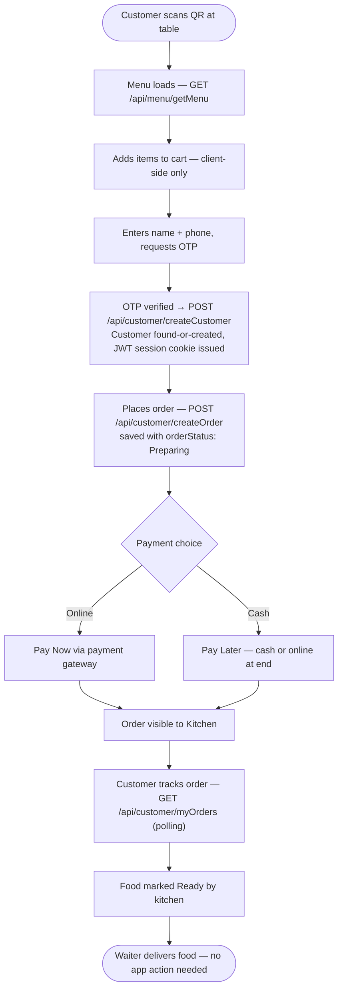
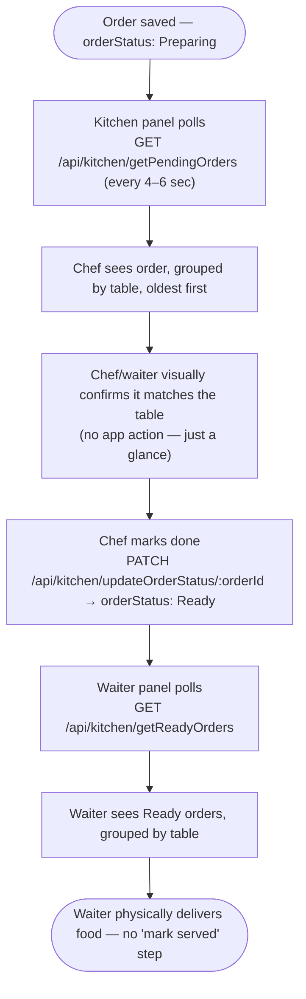
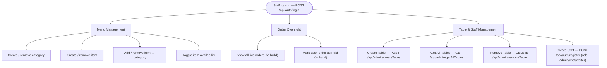

# Restaurant Ordering System

**A QR-based dine-in ordering system for a single restaurant**, built on the MERN stack (MongoDB, Express, React, Node).

> This README is written to give any developer — human or AI — full context on what this app is, how it works end-to-end, and how the codebase is organized, without needing to read through commit history or ask the original author.

---

## Table of Contents

- [1. What This App Does](#1-what-this-app-does)
- [2. Tech Stack](#2-tech-stack)
- [3. Folder Structure](#3-folder-structure)
- [4. Identity & Trust Model](#4-identity--trust-model)
- [5. Workflows](#5-workflows)
  - [5.1 Customer Workflow](#51-customer-workflow)
  - [5.2 Kitchen & Waiter Workflow](#52-kitchen--waiter-workflow)
  - [5.3 Admin / Staff Workflow](#53-admin--staff-workflow)
- [6. Data Models](#6-data-models)
- [7. API Routes Reference](#7-api-routes-reference)
- [8. ID Generation](#8-id-generation)
- [9. Order Completion & Payment Handling](#9-order-completion--payment-handling)
- [10. Order Retention Policy](#10-order-retention-policy)
- [11. Redis Usage](#11-redis-usage)
- [12. Environment Variables](#12-environment-variables)
- [13. Design Decisions & Why](#13-design-decisions--why)
- [14. Roadmap / Not Yet Built](#14-roadmap--not-yet-built)

---

## 1. What This App Does

A customer sits down at a restaurant table, scans a QR code, and gets a live menu in their browser — no app install, no waiter needed to take the order. They build a cart, verify themselves with an OTP sent to their phone, place the order, and track it live as the kitchen prepares it. Meanwhile:

- The **kitchen** sees new orders appear on a screen (polling, not sockets) and marks them ready as food comes off the stove.
- The **waiter** sees which orders are ready and delivers them — no app interaction needed for delivery itself.
- The **admin** manages the menu, tables, and staff accounts, and can see all live orders and sales.

There are **four user-facing surfaces sharing one backend**:

| Interface | Used by | Core purpose |
|---|---|---|
| Customer web menu | Diners, via QR scan → browser | Browse menu, order, pay, track order status |
| Kitchen panel | Chef(s) | See incoming orders, mark them ready |
| Waiter view | Waiter(s) | See which ready orders go to which table |
| Admin panel | Owner/manager | Manage menu, tables, staff, view orders & sales |

**Design philosophy:** this system is built to match how a real restaurant floor actually operates — kitchen and waiter staff don't have time to keep tapping through an app between plates and stoves. So the backend asks for the *minimum* number of actions from staff. Anything unusual (wrong order, cancellation, dispute) is resolved by a human talking to a human — the waiter or manager — rather than another app screen. This is a deliberate simplicity choice, not a missing feature.

---

## 2. Tech Stack

- **MongoDB** + **Mongoose** — primary data store
- **Express** — REST API
- **Node.js** — runtime
- **React** — frontend (in `/Frontend`)
- **Redis** — caching layer + OTP storage (planned/partial — see [Section 11](#11-redis-usage))
- **JWT** — session tokens for both customers and staff, delivered via httpOnly cookies
- **bcryptjs** — staff password hashing
- **nanoid** — short random ID generation (customer IDs, QR tokens)
- **libphonenumber-js** — phone number validation/normalization

---

## 3. Folder Structure

This reflects the actual current repo layout, not an idealized one:

```
Backend/
├── config/
│   ├── database.js          # Mongo connection
│   └── env.js                # centralized env var access
├── controllers/
│   ├── auth.controller.js    # staff register/login/logout/getMe (admin, chef, waiter)
│   ├── customer.controller.js
│   ├── kitchen.controller.js # kitchen AND waiter logic both live here
│   ├── menu.controller.js
│   └── table.controller.js
├── middlewares/
│   ├── auth.middleware.js         # staff session verification
│   ├── customerAuth.middleware.js # customer session verification
│   └── error.middleware.js
├── models/
│   ├── blacklist.model.js    # revoked JWTs, TTL-indexed
│   ├── customers.model.js
│   ├── menu.model.js         # exports both CategoryModel and ItemModel
│   ├── order.model.js
│   ├── staff.model.js        # admin, chef, and waiter all share this one model
│   └── table.model.js
├── routes/
│   ├── auth.routes.js        # staff auth — register/login/logout/getMe
│   ├── customer.route.js
│   ├── kitchen.route.js      # kitchen AND waiter routes both live here
│   ├── menu.routes.js
│   └── table.route.js
├── services/                 # present, not yet populated
├── utils/
│   ├── generateOrderId.js
│   ├── generateTableNumber.js
│   └── generateTableQrToken.js
├── node_modules/
├── .env
├── app.js
├── server.js
├── package.json
└── package-lock.json

Frontend/                     # React app (separate concern, not detailed here)
```

**Naming notes, since these differ from earlier planning docs:**
- There is **no `admin.route.js`** — staff auth (register/login/logout/getMe for admin, chef, *and* waiter accounts) lives in **`auth.routes.js`** / **`auth.controller.js`**.
- There is **no separate `waiter.route.js` or `waiter.controller.js`** — waiter-facing endpoints (`getReadyOrders`, etc.) live inside **`kitchen.route.js`** / **`kitchen.controller.js`** alongside the kitchen's own endpoints.
- There is **no `staffLoginController`** or **`createStaffController`** — these are just **`loginUserController`** and **`createUserController`** in `auth.controller.js`. `createUserController` is the single entry point for creating *any* staff account (admin, chef, or waiter) — the `role` field on the request determines which. There's no separate admin-creation flow.
- There is **no `verifySession`** — the customer-facing session middleware is **`customerAuth.middleware.js`**.
- There is **no `CounterModel`** and **no `OtpModel`** — order IDs are generated with a nanoid-based retry loop (see [Section 8](#8-id-generation)), and OTPs are intended to live in Redis rather than MongoDB.

---

## 4. Identity & Trust Model

Two completely separate authentication systems exist side by side:

**Customers** never set a password. They're verified by a one-time OTP sent to their phone the first time they place an order at a table. On success, they get a JWT session (httpOnly cookie, `customerToken`) so they don't need to re-verify for every order during the same visit.

**Staff** (admin, chef, waiter) log in with a traditional email + password, since they're trusted employees, not walk-in strangers. They also get a JWT session (httpOnly cookie, `token`), verified by a separate middleware.

Both auth systems share the **same blacklist mechanism** (`blacklist.model.js`) for logout — the raw token is hashed (SHA-256) and stored with a TTL, so logging out actually revokes the token server-side rather than just deleting the client-side cookie.

There is currently **one shared `StaffModel`** for all three staff roles (`admin` / `chef` / `waiter`), distinguished by a `role` field. There's also an `isAdmin` boolean on the schema — **this is currently set manually in the database**, not automatically derived from `role`, and will be wired into the frontend/registration flow later. Until that's done, `role === "admin"` and `isAdmin === true` are two separate flags that can theoretically disagree — worth keeping in mind if you're writing permission checks.

---

## 5. Workflows

### 5.1 Customer Workflow



**Notes on this flow, matching what's actually implemented:**
- The menu returns **every item, available or not** — the frontend is responsible for visually distinguishing unavailable items (e.g. greyed out), not the backend. This is intentional: customers should be able to see the full menu, including items currently unavailable, so they know to order them another time.
- `createCustomer` is a **find-or-create**: a phone number that already exists in `CustomerModel` returns that same customer's data and a fresh session token — it does **not** create a duplicate. First-timers get a new record.
- There is currently **no dedicated `sendOtp`/`verifyOtp` controller pair built yet** — OTP verification is expected to gate the call to `createCustomer`, but as of now `createCustomer` can be called directly without OTP proof. This is a known gap to close before going to production (see [Section 14](#14-roadmap--not-yet-built)).
- `createOrder` and `myOrders` both require a valid customer session (`customerAuth.middleware.js`) — `customerId` is read from the verified JWT (`req.customer.customerId`), **never** trusted from the request body, so a customer can't place an order or view history as someone else.

### 5.2 Kitchen & Waiter Workflow



**Order status is intentionally just two values**: `"Preparing"` → `"Ready"`. There's no `"Pending"` pre-acceptance step and no `"Served"` step — an order becomes visible to the kitchen the instant it's created, and delivery is a physical act with no corresponding app state change (see [Section 13](#13-design-decisions--why) for why).

Both `getPendingOrders` and `getReadyOrders` live in **`kitchen.controller.js`** / **`kitchen.route.js`** — there's no separate waiter router.

### 5.3 Admin / Staff Workflow



All staff — regardless of role — authenticate through the **same** `auth.controller.js` / `auth.routes.js`. There's no separate "admin panel login" — an admin, a chef, and a waiter all call `POST /api/auth/login` and get back a session; what they're *allowed to do* with that session is a role-based authorization concern for route-level middleware to enforce (not yet built — see [Section 14](#14-roadmap--not-yet-built)).

---

## 6. Data Models

| Model | File | Purpose |
|---|---|---|
| `CategoryModel`, `ItemModel` | `menu.model.js` | Menu categories and food items. `CategoryModel.items[]` holds embedded copies of items for fast menu reads — kept in sync with the standalone `ItemModel` on every relevant admin mutation. |
| `CustomerModel` | `customers.model.js` | One document per unique phone number. |
| `OrderModel` | `order.model.js` | One document per order. Not embedded in `CustomerModel` — queried independently by table/status for kitchen & waiter views. |
| `TableModel` | `table.model.js` | Table identity — see [Section 8](#8-id-generation) for the two-ID split (friendly number vs. unguessable QR token). |
| `StaffModel` | `staff.model.js` | Shared by admin, chef, and waiter accounts, distinguished by `role`. |
| `TokenBlacklist` | `blacklist.model.js` | Revoked JWTs (both staff and customer), hashed, TTL-indexed to auto-expire. |

**Not present, by design:**
- **No `CounterModel`** — order ID generation currently uses a different approach (see [Section 8](#8-id-generation)).
- **No `OtpModel`** — OTPs are intended to be stored in Redis (native TTL, faster expiry than a Mongo TTL index), not MongoDB.

---

## 7. API Routes Reference

### `menu.routes.js`
| Method | Route | Controller | Status |
|---|---|---|---|
| POST | `/api/admin/createCategory` | `createCategoryController` | ✅ Built |
| DELETE | `/api/admin/removeCategory` | `removeCategoryController` | ✅ Built |
| POST | `/api/admin/createItem` | `createItemController` | ✅ Built |
| DELETE | `/api/admin/removeItem` | `removeItemController` | ✅ Built |
| POST | `/api/admin/addItemToCategory` | `addItemToCategoryController` | ✅ Built |
| POST | `/api/admin/removeItemFromCategory` | `removeItemFromCategoryController` | ✅ Built |
| GET | `/api/admin/fetchAllCategories` | `fetchAllCategoriesController` | ✅ Built |
| GET | `/api/admin/fetchAllItems` | `fetchAllItemsController` | ✅ Built |
| PATCH | `/api/admin/toggleItemAvailability` | `toggleItemAvailabilityController` | ✅ Built |
| GET | `/api/menu/getMenu` | `getMenuController` | 🔲 To build |

### `customer.route.js`
| Method | Route | Controller | Status |
|---|---|---|---|
| POST | `/api/customer/createCustomer` | `createCustomerController` | ✅ Built (find-or-create + session issue) |
| POST | `/api/customer/createOrder` | `createOrderController` | ✅ Built |
| GET | `/api/customer/myOrders` | `getMyOrdersController` | ✅ Built |
| POST | `/api/customer/logout` | `logoutCustomerController` | ✅ Built |
| POST | `/api/customer/sendOtp` | `sendOtpController` | 🔲 To build |
| POST | `/api/customer/verifyOtp` | `verifyOtpController` | 🔲 To build |
| POST | `/api/customer/initiatePayment` | `initiatePaymentController` | 🔲 To build |

### `kitchen.route.js` (kitchen + waiter)
| Method | Route | Controller | Status |
|---|---|---|---|
| GET | `/api/kitchen/getPendingOrders` | `getPendingOrdersController` | ✅ Built |
| PATCH | `/api/kitchen/updateOrderStatus/:orderId` | `updateOrderStatusController` | ✅ Built |
| GET | `/api/kitchen/getReadyOrders` | `getReadyOrdersController` | ✅ Built |

### `table.route.js`
| Method | Route | Controller | Status |
|---|---|---|---|
| POST | `/api/admin/createTable` | `createTableController` | ✅ Built |
| GET | `/api/admin/getAllTables` | `getAllTablesController` | ✅ Built |
| DELETE | `/api/admin/removeTable` | `removeTableController` | ✅ Built |

### `auth.routes.js` (staff — admin / chef / waiter)
| Method | Route | Controller | Status |
|---|---|---|---|
| POST | `/api/auth/register` | `createUserController` | ✅ Built (creates any role) |
| POST | `/api/auth/login` | `loginUserController` | ✅ Built (rate-limited) |
| POST | `/api/auth/logout` | `logoutUserController` | ✅ Built |
| GET | `/api/auth/getMe` | `getMeController` | ✅ Built |

### Not yet built at all
| Purpose | Suggested route | Suggested controller |
|---|---|---|
| Admin order oversight | `GET /api/admin/getAllOrders` | `getAllOrdersController` |
| Mark cash order paid | `PATCH /api/admin/markCashPaid/:orderId` | `markCashPaidController` |
| Payment webhook | `POST /api/payment/webhook` | `paymentWebhookController` |
| Sales dashboard | `GET /api/admin/dashboardStats` | `getDashboardStatsController` |

---

## 8. ID Generation

Three different ID types, three different strategies — deliberately not all the same, because they have different requirements:

| ID | Needs to be | Current approach |
|---|---|---|
| `orderId` | Unique, ideally sequential | `nanoid`-based random 6-digit number + DB uniqueness retry loop (`generateOrderId.js`). **Not currently sequential** — see note below. |
| `tableNumber` | Unique, human-friendly | Count-based: `T-${count + 1}`, checked against existing records in a retry loop (`generateTableNumber.js`) |
| `qrToken` (table) | Unique, **unguessable** | `nanoid` random alphanumeric string, prefixed `TBL_` (`generateTableQrToken.js`) |
| `staffId` | Unique, human-friendly, role-indicating | Count-based per role: `${roleCode}-${count + 1}` (e.g. `CHF-001`) |
| `customerId` | Unique | `nanoid` 8-character alphanumeric |

**Why `tableNumber` and `qrToken` are two separate fields, not one:** a table identifier needs to be human-friendly for admin/staff to read (`T-05`) but the value that goes into the actual QR code URL needs to be *unguessable*, so a customer can't tamper with `?table=5` in the URL bar to place an order that lands on someone else's table. One field can't satisfy both requirements at once, so `TableModel` carries both.

**On `orderId` not being truly sequential right now:** the original plan (documented previously) was an atomic MongoDB counter (`CounterModel` + `findOneAndUpdate` + `$inc`), which guarantees no race conditions and clean sequential numbers (`1000`, `1001`, `1002`...). That model **does not exist in this codebase currently** — the actual implementation generates a random 6-digit number and retries on collision. This works correctly (no duplicates possible) but order IDs will **not** come out in visually sequential order on kitchen tickets/receipts. If sequential IDs matter for the final product (they usually do, for readability), reintroducing `CounterModel` is a small, self-contained change — flagged here so it doesn't get lost.

**On `tableNumber`/`staffId` using count-based generation instead of an atomic counter:** this has a theoretical (very unlikely in practice) race condition if two admins added a table/staff account in the same instant — the retry loop resolves it safely (no duplicates ever get saved), it's just not as clean as an atomic `$inc`. Given how infrequently tables/staff are added (a one-person, low-frequency admin action), this tradeoff is intentional and fine as-is.

---

## 9. Order Completion & Payment Handling

**Case A — Online Payment ("Pay Now")**
1. Order created with `paymentStatus: "Pending"`, `paymentMode: "Online"`.
2. Frontend/backend creates a payment-gateway session (Razorpay or similar) for the order amount.
3. Customer pays via the gateway's checkout UI.
4. Gateway calls a backend **webhook** (not a frontend callback — those can be spoofed) to confirm payment.
5. On verified webhook signature: `paymentStatus → "Paid"`.

**Case B — Cash Payment ("Pay Later")**
1. Order created with `paymentStatus: "Pending"`, `paymentMode: "Cash"`. No gateway involved.
2. Order proceeds through the normal kitchen/waiter lifecycle unchanged.
3. At the end of the meal, staff manually mark it settled (`markCashPaid`, not yet built), recording which staff member confirmed it for accountability.

**Design decision already made:** the kitchen does **not** wait for `paymentStatus: "Paid"` before cooking — `orderStatus` and `paymentStatus` progress independently. This avoids food delays caused by payment gateway latency, matching how most dine-in QR-ordering apps (Zomato/Swiggy-style) operate.

---

## 10. Order Retention Policy

**Orders are never hard-deleted.** Once created, an order document stays forever — its `orderStatus` and `paymentStatus` fields represent its lifecycle, not its existence.

Reasons: historical data is needed for sales reports and dispute resolution; it's your audit trail if a payment issue comes up later; and storage cost for order history is negligible.

If an order needs to be voided, that happens by a human decision (customer tells the waiter/manager directly — **there is intentionally no in-app cancel/update flow**, see [Section 13](#13-design-decisions--why)), and a manager can set `orderStatus: "Cancelled"` directly through the (not-yet-built) admin order view.

The only exception: abandoned orders that never got past OTP verification or payment initiation with zero kitchen activity are reasonable to clean up via a scheduled job — genuine, fulfilled, or manager-voided orders are always kept.

---

## 11. Redis Usage

Redis is planned/partially used for anything read far more often than it changes, or inherently short-lived:

1. **Menu data** (`menu:full`) — the single highest-impact cache candidate, since the menu is read on every QR scan but only changes on admin edits. Invalidate on every menu-mutating admin controller.
2. **OTP storage** (`otp:<phone>`, `EX 300`) — instead of a Mongo model, since Redis TTL is faster and more precise than Mongo's background TTL sweep (~60s intervals).
3. **Active order lists** (`orders:preparing`, `orders:ready`) — for kitchen/waiter polling endpoints, invalidated on every order-status-changing write.
4. **Table status** (`table:<tableId>:status`) — checked often, changes rarely.
5. **Rate limiting** — for OTP-send abuse protection, using a Redis-backed store so limits survive server restarts (an in-memory object doesn't).

**Do not cache:** individual customer order history or admin financial stats — low-traffic, per-user/session data that should always be fresh; caching these adds complexity for little benefit.

---

## 12. Environment Variables

Based on what the codebase currently references:

```bash
MONGO_URI=              # MongoDB connection string
JWT_SECRET=              # shared secret for signing both staff and customer JWTs
CLIENT_URL=               # frontend base URL, used to build QR code URLs
REDIS_URL=                # (planned) Redis connection string
COOKIE_SECURE=             # true in production (HTTPS only cookies)
COOKIE_SAME_SITE=          # e.g. "lax" or "strict"
COOKIE_MAX_AGE=            # in ms, for staff session cookie
```

Accessed centrally through `config/env.js` rather than scattered `process.env` calls throughout the codebase — keep new env vars wired through there for consistency.

---

## 13. Design Decisions & Why

A few choices in this codebase are intentional simplifications, not oversights — noting them here so they don't get "fixed" by someone unfamiliar with the reasoning:

- **No table-confirmation app step.** A chef/waiter can see who's sitting where on the floor; if an order's table number looks wrong, they resolve it by talking to the table, not through a dedicated in-app confirmation action.
- **No "mark served" step.** Waiters are on their feet and don't have time to tap a phone for every plate delivered. Once an order is `Ready`, delivery is physical and the app's tracking of that order effectively ends there.
- **No in-app order cancel/update flow.** Preventing the kitchen from reacting to an order that got silently edited mid-preparation. Cancellations/changes go through a human conversation with the waiter/manager.
- **Customer menu shows unavailable items too**, rather than hiding them — customers should be able to see the full menu and plan future orders around what's currently unavailable, not just see a shorter list with no explanation.
- **`orderStatus` and `paymentStatus` are independent** — the kitchen doesn't wait on payment confirmation to start cooking.

---

## 14. Roadmap / Not Yet Built

In rough priority order:

1. **`sendOtpController` / `verifyOtpController`** — closes the current gap where `createCustomer` can be called without OTP proof.
2. **`verifyStaffAuth` role-based route guarding** — right now any authenticated staff member can theoretically hit any staff route; role checks (e.g. only `admin` can delete a category) aren't enforced yet.
3. **`getAllOrdersController`** (admin order oversight) + **`markCashPaidController`**.
4. **Payment gateway integration** — `initiatePaymentController` + `paymentWebhookController` + `verifyWebhookSignature` middleware.
5. **Redis integration** — currently designed for but not yet wired into the codebase (client setup, OTP storage, menu caching).
6. **`getDashboardStatsController`** — sales/analytics aggregation.
7. **Automatic `isAdmin` derivation from `role`** on staff creation, replacing the current manual DB edit.
8. **Reconsider `CounterModel`** for `orderId` if sequential, receipt-friendly order numbers matter for the final product.
9. **Rate limiting on `sendOtp`** once it exists, mirroring the existing `LoginLimiter` pattern already used on staff login.